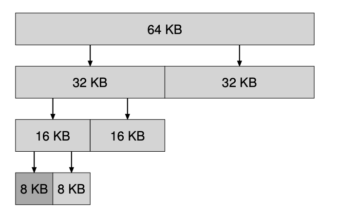

# Binary buddy allocator
This README is more of a walkthrough of how the binary buddy algorithm was designed, to understand its core principles!

## Design ideas
The main goal of any kind of buddy allocator is to minimize external fragmentation. If we implement a basic free list, it will handle variable-sized chunks of memory. No matter what kind of implementation we choose(first fit, best fit, worst fit etc), we will have the problem of external fragmentation. Some designs will minimize the problem, but it will still exist.

### Model one: Fixed-sized blocks
The way to solve this problem of external fragmentation would be with the use of a free list that manages fixed size blocks of memory. This is what the idea of `paging` essentially is. However, for managing the heap of a process, we have two problems: ask for bigger size, allocation fails and ask for smaller size, we waste memory(internal fragmentation).


### Model two: Multiple free lists
So now, another idea is that instead of just having fixed sized units, why don't we instead have multiple free lists to manage various fixed-size blocks of memory. For example, one free list will only have blocks of size 512 bytes, and then the other free list will only manage blocks of size 1024 bytes. This can help minimize internal fragmentation better than the previous model.

We now have two things to consider:
1. #### How should splitting be performed?
    For example, if we have a request for 500 bytes, and we are out of blocks of size 512 bytes, what should we do? Let's say we have a block of 1024 bytes available. It would be ideal if we can split this into two equal-sized blocks and return one to the user and add the other one to its appropriate free list. However, this would only make sense if there is some way to merge it(coalesce) back once the user frees the block.

2. #### So, how should we perform coalescing?
    Ideally, we always want to have big continuous chunks of memory, as that gives us flexibility for allocation. From the previous example, given that we split a block into two "buddies", one was returned to the user and one was added back to its free list. However, when the user frees the block, it makes sense that we combine this block with its buddy if it is not in use and have the parent block in its free list.

#### Observations
1. This splitting and coalescing can be done recursively. I am going to cheat and paste a screenshot from OSTEP here.


    In this example, the user asked for a block of size 7KB. Initially, we only had one block of size 64KB in the 64KB freelist. All the other freelists for different block sizes are initially empty. So, we split that into 32KB blocks. We added one of them to the 32KB freelist and split the other one again. We repeat this splitting until we have 2 8KB blocks. Since this is the smallest we can fit 7KB in, we return one of them(allocate) and add the other 8KB block to the freelist for 8KB blocks. We can see how we performed recursive splitting here.
Now, when the user frees the 8KB block, we(the allocator) will check whether the buddy is free. If so, we coalesce the two blocks into a 16KB block. We then check whether its buddy is free. We keep doing this up the tree until a buddy is found to be in use or we have restored the entire memory space.

2. How should we know if a block has a buddy or not? If we start with multiple freelists with initialized blocks, the initial blocks don't have buddies because they don't have a parent they split from. One option is to just start with the free memory conceptually of size 2<sup>N</sup> i.e, one block of size 2<sup>N</sup>. This block size is the only block that will not have a buddy. This means that initially, all the other freelists for smaller fixed-size blocks will be empty. Now, when splitting happens, we will be guaranteed that smaller block sizes will have a buddy.

## Overview
Now that we have walked through the design principles, let us lay a framework for the algorithm.

* Free memory is initially thought of as one big space of some size 2<sup>N</sup>. Having memory as a power of 2 will make splitting possible since we can exactly split a block into 2 equal sized blocks.
* We have a free list for each $n$ such that min. alloc. size <= 2<sup>n</sup> <= 2<sup>N</sup>
* Initially, we only have a chunk of size 2<sup>N</sup> as the only element in our free list for size 2<sup>N</sup>. All the other free lists are empty.
* All the free lists are implemented as doubly linked lists.
* Allocation: 
    1. When a request for allocation of size $K$ is made, we want to check the free list for the smallest block that can contain $K$<small>(plus some header information)</small>. So, round $K$ to the nearest size 2<sup>i</sup>.
    2. For the sake of this example, let's say that $i$ is the index of the freelist in the freelists array. So, if <i>freelist[i]</i> contains a block, we return the block after encoding the necessary header information.
    3. Otherwise, we look for a block in a larger list <i>freelist[j]</i> such that j>i.
        * Recursively split that block into two until we get down to a size of 2<sup>i</sup>.
        * Put all the unused blocks in their respective freelists.
        * Return the one necessary.
* Freeing:
    1. Compute the buddy's address to see if the buddy is unused.
        * If the block starts at address $a$ and is of size 2<sup>K</sup>, the buddy's address = a ⊕ 2<sup>K</sup>. [Why](#finding-the-buddy)?
        Alternatively, the block could have stored the buddy's address in its header information. However, this would only have been a waste of space since it is very easy to compute the address.
    2. If the buddy is free(i.e, in a free list), then remove the buddy from the freelist. This is why we chose a doubly linked list. Merge them into a block of size 2<sup>K+1</sup>
    3. Repeat until no merge is possible(i.e, a buddy is in use) or we reach the maximum block size.

## Header and node information
We need to have some header information for each block of memory. We need to know whether it is free, what the value $k =$ log<sub>$2$</sub>(size) is etc. Moreover, for the blocks in the free list, we need to keep track of the next and previous blocks as well.

In our implementation, we use these structs to define our header and node:
```c
typedef struct{
  size_t size;
  bool free;
} header;

// We will use struct inheritance to access `header` for any node in the free list
typedef struct __node{
  header header;
  struct __node * next;
  struct __node * previous;
} node;
```

## Summary
There we go. Now that we have a good overview of the binary buddy allocator, looking at the code itself should be useful. I would also recommend looking at online articles for implementation details. You will find loads of articles on that. I only wrote this README because I didn't find any that walked me through the design goals.

Binary buddy allocator still suffers from internal fragmentation. However, it makes coalescing much easier which is necessary for any allocator. Moreover, it is just a smart idea. I like it.

### Extra: Finding the buddy
Let us assume a block of size 2<sup>k</sup> starts at address $a$. Now, I will try to give you an idea(not a full proof) as to why:
```python
buddys_address = a ^ 2**K
buddys_address = a ^ (1 << k) # another option
```

The XOR operation works because the address of each buddy pair only differs on the $K$<sup>th</sup> bit. So, performing XOR will make sure only the $K$<sup>th</sup> bit is flipped. But why does the address for each buddy pair only differ on the $K$<sup>th</sup> bit?

If we think closely, we will notice that the address of a block of size 2<sup>K</sup> is always at $C \cdot 2^K$ where $C \in \mathbb{Z+}$. One way to prove this is by proof of induction. I will leave that for the reader.

Now, the buddy on the "left" will have the same address as its parent that it split from. Let the address of the parent be $C \cdot 2^{K+1}$. This means that the $K^{th}$ bit of this address will be a zero. Now, what about the other buddy? The buddy's address will be $C \cdot 2^{K+1} + 2^{k}$. This means that now the $K^{th}$ bit will be a 1. This shows that only the $K^{th}$ bit is different in the addresses of a buddy pair.
